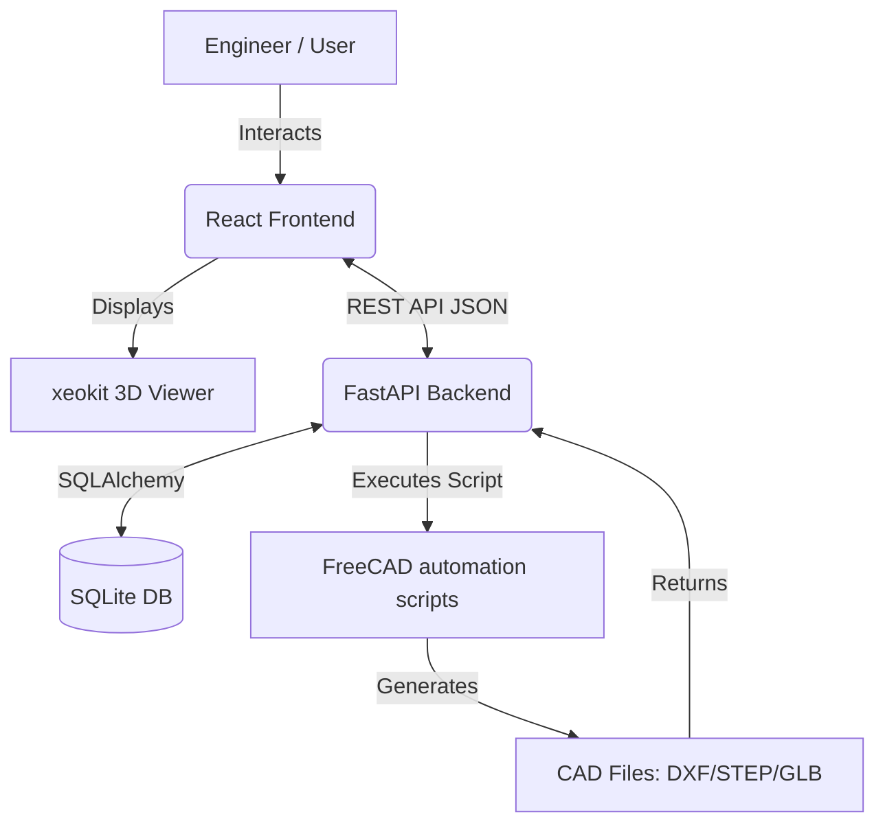

# SKF3 CAD Configurator - Comprehensive Developer Guide

## 1. Project Overview

**Project Type**: AI CAD automation backend & interactive web configurator  
**Tech Stack**: Python, FastAPI, FreeCAD API (Backend) | React 19, Vite, xeokit-sdk (Frontend)  
**Purpose**: Generate parametric CAD models from dynamic inputs without manual drafting.  
**Users**: Internal Engineers and Technical Procurement Specialists  

### What the Project Does
The SKF3 CAD Configurator allows engineers to graphically configure SKF linear motion systems and automatically generate engineering-grade 3D CAD files in multiple formats. 

### Problem it Solves
Traditionally, generating variations of bearings, guide rails, and linear motion components requires manual drafting or waiting on CAD designers. This project completely automates parametric CAD generation, accelerating design pipelines and allowing internal engineers to self-serve highly specific components interactively.

### High-level Workflow
1. **Configure**: User inputs Application, Geometry, and Materials parameters via the React frontend.
2. **Render**: Real-time 3D model visualization is provided in-browser via `xeokit-sdk` (using `.glb` files).
3. **Request**: The frontend submits the final configuration payload to the Python/FastAPI backend.
4. **Generate**: The backend leverages the FreeCAD API (via Python automation scripts, e.g., `T_bolt.py`) to procedurally generate the requested CAD model constraint-by-constraint.
5. **Export**: The generated files (STEP, DXF, GLB) are securely returned to the user for download.

---

## 2. System Architecture

### Overall Architecture Explanation
The application follows a decoupled client-server architecture. The frontend handles complex user state and 3D web rendering, while the backend acts as a fast API serving configurations, handling database persistence, and orchestrating intensive 3D CAD generation via FreeCAD.



### Components and Interaction
*   **React SPA Client**: Collects user constraints and provides immediate visual feedback.
*   **FastAPI REST Layer**: Routes requests, validates inputs using `Pydantic`, handles CORS, and manages jobs.
*   **Export Service**: An asynchronous CAD engine orchestration layer that translates user parameters into FreeCAD API constraints (e.g., `backend/app/services/export_service.py`).
*   **FreeCAD Headless Engine**: Executed via Python scripts (like `backend/scripts/parametric_tbolt.py` and `T_bolt.py`), building solid bodies (Pads, Revolutions, Sketches) programmatically.

---

## 3. Folder Structure

```text
c:\Users\shashank\Desktop\projects\SKF3\
├── backend/                  → All backend API & CAD engine code
│   ├── app/                  → Core FastAPI application
│   │   ├── api/v1/routes/    → API endpoints (configurations.py, exports.py, cad.py)
│   │   ├── core/             → Project settings and CAD engine coordinators 
│   │   ├── db/               → SQLAlchemy database models & session management
│   │   ├── schemas/          → Pydantic validation schemas
│   │   ├── services/         → Business logic (export_service.py, cad_service.py)
│   │   └── main.py           → FastAPI application entry point
│   ├── scripts/              → Scripts triggering FreeCAD headlessly (e.g. parametric_tbolt.py)
│   └── requirements.txt      → Python package dependencies
├── frontend/                 → React/Vite web application
│   ├── public/models/        → Target directory for static / generated GLB viewer models
│   ├── src/                  → React application source code
│   │   ├── components/       → Reusable UI & configurator panels (Preview3D.jsx, InputPanel.jsx)
│   │   ├── constants/        → Parameter definitions (parameters.js rules engine)
│   │   ├── pages/            → Top level route screens
│   │   └── services/         → Frontend API clients (api.js)
│   ├── Docs/                 → Frontend and API technical specifications
│   └── package.json          → Node package dependencies
├── T_bolt.py                 → FreeCAD automation script example (builds stepped tube)
├── run_backend.bat           → Startup shortcut for the backend environment
└── skf_configurator.db       → SQLite database (auto-generated)
```

---

## 4. Installation Guide

### Required Software
*   **Python 3.10+**
*   **Node.js 18+** (with `npm` 9+)
*   **FreeCAD** (Must be installed and added to your system PATH / Python paths for the headless scripts to run seamlessly)

### Step-by-Step Installation

**1. Clone & Setup Backend**
```bash
cd backend
python -m venv venv
# Activate on Windows:
venv\Scripts\activate
# Install deps:
pip install -r requirements.txt
```

**2. Setup Frontend**
```bash
cd ../frontend
npm install
```

**3. Running the System Locally**
The project includes a convenient `run_backend.bat` script for Windows that will activate the virtual environment and start the Uvicorn server automatically.

*Terminal 1 (Backend):*
```bash
.\run_backend.bat
# Backend runs on http://localhost:8000
```
*Terminal 2 (Frontend):*
```bash
cd frontend
npm run dev
# Frontend runs on http://localhost:5173
```

> **Developer Tip**: Always ensure the virtual environment (`venv`) is active before running Python scripts or dealing with Uvicorn errors.

---

## 5. Configuration

*   **Backend Environment Variables**: By default, parameters are loaded via `pydantic-settings` in `backend/app/core/config.py`. 
    *   `PROJECT_NAME`: Defaults to "SKF CAD Configurator"
    *   `BACKEND_CORS_ORIGINS`: Defaults to `["http://localhost:5173"]` allowing React to communicate effectively.
*   **Frontend Environment Variables**: Managed via Vite (`.env.development` or `.env.production`).
    *   `VITE_API_BASE_URL`: (Optional) define your base backend URL, defaults to `http://localhost:8000/api/v1` in `api.js`.
*   **Database**: Uses SQLite (`skf_configurator.db`) by default. Configured in `app/db/session.py`.

---

## 6. Code Walkthrough

### Major Modules & Responsibilities
*   **`frontend/src/constants/parameters.js`**: The brains of the frontend configurator validation logic. Maps every configurable part parameter (Application, Geometry, Material) to its boundary rules (e.g., minimum height, step dependencies).
*   **`frontend/src/components/configurator/Preview3D.jsx`**: Manages the `xeokit-sdk` instance. It handles initializing the 3D canvas, loading `.glb` objects, and implementing advanced rendering tools like Section planes, dimension annotations, and model orbit.
*   **`backend/app/services/export_service.py`**: Intercedes between the API layer and the actual CAD engine layer. It accepts a known configuration ID, extracts exact physical limits (`geometry_params`), and invokes the actual generator.
*   **`T_bolt.py` & `backend/scripts/parametric_tbolt.py`**: Contains the pure FreeCAD Python macros manipulating FreeCAD primitives (`PartDesign::Body`, `Sketcher::SketchObject`) and injecting constraints (e.g., `DistanceX`, `Vertical`). When executed, this creates a fully solid parametric `.FCStd` or exported STEP file based on the injected variables.

---

## 7. API Documentation

Base URL: `http://localhost:8000/api/v1`

### 1. Create Configuration
*   **Endpoint**: `POST /configurations/`
*   **Request Body** (JSON): 
    ```json
    {
      "part_number": "SKF-1029",
      "surface_treatment": "Anodized",
      "number_of_blocks": 2,
      "geometry_params": { "H": 25, "W": 50, "C": 12 },
      "material_params": { "greaseType": "LGMT 2" }
    }
    ```
*   **Response**: `200 OK`
    ```json
    { "id": 12, "part_number": "SKF-1029", "status": "draft", "created_at": "..." }
    ```

### 2. Request CAD Export
*   **Endpoint**: `POST /exports/`
*   **Request Body**:
    ```json
    {
      "configuration_id": 12,
      "format": "STEP"
    }
    ```
*   **Response**: `200 OK` (Returns the export job entity containing `status: processing` eventually finishing with `completed` and `file_path`).

---

## 8. How the System Works (Execution Flow)

1.  **UI Interaction**: The engineer starts selecting properties in the `InputPanel.jsx`. Validation runs locally utilizing the `parameters.js` schema.
2.  **Visual Update**: As properties change, `Preview3D.jsx` updates annotations or swaps/transforms `.glb` proxy files mirroring spatial changes immediately.
3.  **Submission**: User clicks "Apply". Frontend asynchronously calls `POST /api/v1/configurations/`.
4.  **Save to DataLayer**: FastAPI receives the payload via `configurations.py`, checks logic utilizing `schemas/configuration.py`, and records the data string to the SQLite database via SQLAlchemy.
5.  **Export Trigger**: User explicitly requests "Download CAD". Frontend calls `POST /api/v1/exports/`.
6.  **CAD Engine Pipeline**: 
    *   `export_service.py` fetches the required geometry (`H=25`, `W=50`).
    *   These parameters are piped into the background Python automation script referencing FreeCAD libraries.
    *   The FreeCAD engine spins up headlessly. It applies constraints point-by-point to generate the solid. 
    *   The Part is exported to `exports/SKF-1029.step`.
7.  **Delivery**: Backend updates the export status and returns the file download URL to the user.

---

## 9. How to Add New Features

### Adding a New CAD Component Type (e.g., A new Fastener)
1.  **CAD Scripting**: Write a procedural FreeCAD script mapping variables (height, length) to sketch constraints, similar to how it works in `T_bolt.py`. Expose it as a function e.g. `generate_fastener(params_dict)`.
2.  **Parameters Definition**: Under `frontend/src/constants/`, add the parameters dictionary required to dictate the new geometry constraint rules (e.g., `parameters_fastener.js`).
3.  **Import to Backend Service**: Update `backend/app/services/cad_service.py` or `export_service.py` with an execution branch that targets this new fastener and imports your script.
4.  **Update UI**: Connect the new parameter scheme to `InputPanel.jsx` components so users can modify its values. 

---

## 10. Common Errors and Troubleshooting

*   **Error: `ModuleNotFoundError: No module named 'fastapi'`**
    *   *Cause*: Virtual environment is not activated.
    *   *Fix*: Run `venv\Scripts\activate` before starting Uvicorn, or rely strictly on `run_backend.bat`.
*   **Error: `Network Error / React fails to save`**
    *   *Cause*: Uvicorn isn't running on `localhost:8000`, or CORS strictly disabled.
    *   *Fix*: Test `http://localhost:8000/health`. Check `BACKEND_CORS_ORIGINS`.
*   **Error: `xeokit Viewer fails to render (Black Screen)`**
    *   *Cause*: The 3D browser component failed to load the `.glb` target, or your system lacks WebGL. 
    *   *Fix*: Check Chrome DevTools `Network` tab to ensure the `.glb` model payload completed successfully. Use `.glb` over `.gltf` for binary density.
*   **Error: `FreeCAD macro crashes silently / FreeCAD throws error`**
    *   *Cause*: The script is requesting over-constrained or conflicting geometries (e.g. inner radius > outer radius).
    *   *Fix*: Wrap the script blocks with `try-except` and log exact failure constraints. Ensure GUI validation prevents conflicting geometry arrays from reaching the API layer.

---

## 11. Deployment Guide

Although designed initially for local engineering access, standard CI/CD deployment logic applies:
1.  **Frontend (Vite/React)**:
    *   Run `npm run build` directly in the `frontend` root. 
    *   Serve the optimized `/dist` folder behind Nginx, Amazon S3, or Vercel. Route all unknown paths (SPA fallback) to `index.html`.
2.  **Backend (FastAPI)**:
    *   A containerized deployment (e.g., **Docker**) is heavily recommended here because `FreeCAD` headless bins must exist smoothly alongside Python 3. `apt-get install freecad` inside a Debian-based container forms the foundation.
    *   Copy the `backend` contents, run `pip install -r requirements.txt`. Startup point: `uvicorn app.main:app --host 0.0.0.0 --port 80`.
    *   Switch `app.db.session` to `postgresql://...` for concurrent user writes.

---

## 12. Future Improvements
*   **Authentication & Roles**: Implement standard OAuth2 so users can save/manage configurations inside personal accounts and track previous iterations.
*   **Task Queue Handling**: Intensive CAD generation (subprocesses running FreeCAD) should be shipped to a worker farm/queue (like **Celery** or **Redis Queue**). Holding the HTTP connection over `export_service.py` open is dangerous sequentially.
*   **WebGL Performance**: Introduce runtime level-of-detail (LOD) optimization for dynamically rendering highly dense `.glb` assemblies to reduce vRAM spikes.
*   **Interactive Annotations**: Direct model-click parameter modification on the 3D `<canvas>` without using the `InputPanel.jsx`.
