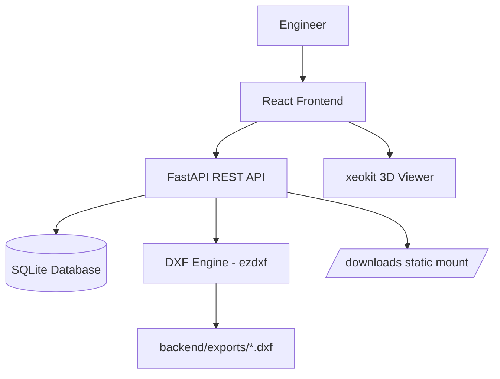
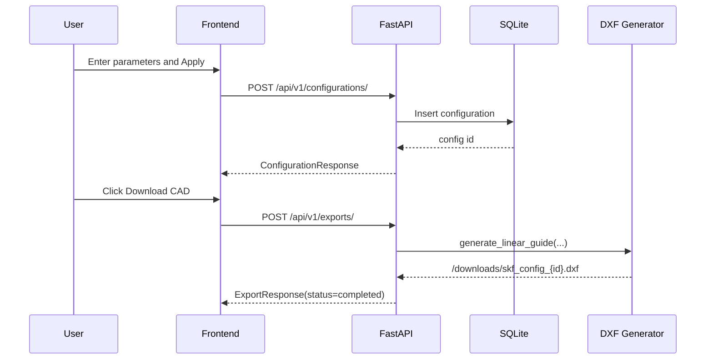

# System Architecture

## Overview

SKF3 follows a client-server architecture:

- Frontend handles user interaction, parameter validation, and 3D viewing.
- Backend handles persistence, API orchestration, and CAD export generation.
- Generated CAD files are served as static downloads.

## Architecture Diagram

## Component Breakdown

### Frontend

Primary responsibilities:

- Product schema selection (`frontend/src/constants/schemas.js`)
- Step-based input + validation (`frontend/src/features/configurator/components/InputPanel.jsx`)
- 3D preview and CAD download trigger (`frontend/src/features/configurator/components/Preview3D.jsx`)
- API integration (`frontend/src/services/api.js`)

### Backend API

Primary responsibilities:

- FastAPI app bootstrap and middleware (`backend/app/main.py`)
- Route aggregation (`backend/app/api/v1/router.py`)
- Configuration endpoints (`backend/app/api/v1/routes/configurations.py`)
- Export endpoints (`backend/app/api/v1/routes/exports.py`)

### Persistence Layer

- SQLAlchemy models in `backend/app/db/models.py`
- Session dependency in `backend/app/db/session.py`
- SQLite configured via `DATABASE_URL` in `backend/app/core/config.py`

### CAD Layer

Active API-driven generation:

- `backend/app/core/cad_engine.py` (`DXFGenerator.generate_linear_guide`)

Supplementary standalone CAD scripting:

- `T_bolt.py`
- `pully1.py`

## Request Lifecycle

## Folder References

- Backend API: `backend/app/api/v1/`
- Services: `backend/app/services/`
- CAD exports: `backend/exports/`
- Frontend configurator: `frontend/src/features/configurator/`
- Parameter schemas: `frontend/src/constants/`

## Design Notes

- Backend currently creates DB tables on startup (`Base.metadata.create_all`).
- Export requests run synchronously in request cycle; no queue worker yet.
- Route `GET /health` is root-level and intentionally separate from `/api/v1`.
