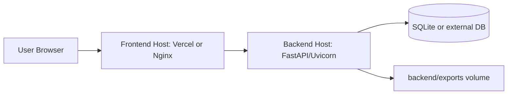

# Deployment

## Overview

Current repository setup naturally splits deployment into:

- Frontend static app (`frontend/dist`) deployable to Vercel or any static host
- Backend FastAPI service (`backend/`) deployable on VM/container

`vercel.json` in repo root already configures SPA rewrites for frontend output.

## Deployment Topology



## Environment Variables

Backend (`backend/app/core/config.py`):

- `DATABASE_URL` default: `sqlite:///./skf_configurator.db`
- `BACKEND_CORS_ORIGINS` default: `["http://localhost:5173"]`

Frontend:

- `VITE_API_BASE_URL` default in code: `http://localhost:8000/api/v1`

For production, set:

- `VITE_API_BASE_URL=https://<your-backend-domain>/api/v1`
- backend CORS origins to include deployed frontend domain

## Backend Deployment (Direct)

```bash
cd backend
python -m venv venv
venv\Scripts\activate
pip install -r requirements.txt
uvicorn app.main:app --host 0.0.0.0 --port 8000
```

Recommended process manager:

- `gunicorn` with Uvicorn workers on Linux
- NSSM or Windows service wrappers on Windows

## Frontend Deployment

Build:

```bash
npm run build
```

This produces:

- `frontend/dist/`

With current `vercel.json`, SPA routes are rewritten to `/`.

## Docker Example (Reference)

This repo does not include Dockerfiles yet; sample below can be used as a starting point.

Backend Dockerfile example:

```dockerfile
FROM python:3.11-slim
WORKDIR /app
COPY backend/requirements.txt /app/requirements.txt
RUN pip install --no-cache-dir -r requirements.txt
COPY backend /app
EXPOSE 8000
CMD ["uvicorn", "app.main:app", "--host", "0.0.0.0", "--port", "8000"]
```

Frontend Dockerfile example:

```dockerfile
FROM node:20-alpine AS build
WORKDIR /app
COPY frontend/package*.json ./
RUN npm install
COPY frontend ./
RUN npm run build

FROM nginx:alpine
COPY --from=build /app/dist /usr/share/nginx/html
EXPOSE 80
CMD ["nginx", "-g", "daemon off;"]
```

Compose sketch:

```yaml
services:
  backend:
    build:
      context: .
      dockerfile: backend.Dockerfile
    ports:
      - "8000:8000"
    volumes:
      - ./backend/exports:/app/exports
  frontend:
    build:
      context: .
      dockerfile: frontend.Dockerfile
    ports:
      - "5173:80"
```

## Post-Deploy Verification

1. Check backend health:
   - `GET https://<backend-domain>/health`
2. Check docs:
   - `GET https://<backend-domain>/docs`
3. Validate frontend API connectivity:
   - confirm configuration create and export flow in UI
4. Confirm file serving:
   - ensure `/downloads/<file>.dxf` is reachable

## API Smoke Test Example

```bash
curl -X POST "https://<backend-domain>/api/v1/configurations/" ^
  -H "Content-Type: application/json" ^
  -d "{\"part_number\":\"SMOKE-1\",\"geometry_params\":{\"W\":25,\"LS\":300}}"
```
